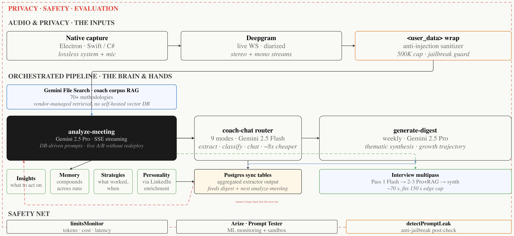

# Interview Analysis Coach

### Your AI-Powered Interview Coach

Interview Analysis Coach turns every interview — practice or real — into a structured coaching report. It listens, evaluates across multiple lenses, and tells you exactly what worked, what didn't, and what to do differently next time. [Website](https://proleap.ai/interview)

---

## What is Interview Analysis Coach?

Interview Analysis Coach is an AI feedback platform that records and analyzes your interviews — practice runs, mocks, or the real thing — and delivers a detailed, evidence-based coaching report within minutes.

No more replaying interviews in your head wondering what went wrong. No more vague "you did great" from friends. Every observation is tied to a specific moment in your conversation, scored against the methodologies of 70+ world-class coaches.

## How It Works

1. **Record** — Interview Analysis Coach captures your interview through your laptop (Zoom, Google Meet, Teams, or in-person).
2. **Analyze** — A multi-pass AI pipeline evaluates your performance across structure, content, mindset, and red flags — grounded in coaching frameworks from interview experts, negotiators, and operators.
3. **Report** — You get a structured report covering question-by-question evaluation, gaps you missed, the candidate questions you should have asked, and the signals an interviewer would have picked up.
4. **Iterate** — Apply the feedback in your next round. Track patterns across interviews to see what's improving and what's still a blocker.

## Key Features

- **Multi-Pass Analysis** — Three independent analytical passes evaluate structure, content, and mindset separately, then synthesize a final report. Catches what a single read-through misses.
- **Question-by-Question Evaluation** — Every interviewer question is scored on response quality, clarity, depth, and use of concrete examples.
- **Red Flag Detection** — Surfaces moments that would raise concern for an interviewer — vague answers, deflection, contradictions, weak ownership.
- **Gap Analysis** — Identifies what you should have said but didn't — missing examples, unaddressed concerns, opportunities you walked past.
- **Candidate Questions Audit** — Evaluates the questions you asked the interviewer (or didn't ask) and suggests stronger alternatives.
- **AI Fluency Signals** — Calibrates how well you communicated technical depth without over-jargoning or hand-waving.
- **Mindset Signals** — Picks up on tone, confidence patterns, and framing — the things that shape interviewer perception beyond the literal answer.
- **Coaching Framework Library** — Feedback is grounded in 70+ coach methodologies (negotiation, communication, leadership, storytelling) retrieved via semantic search.
- **Pre-Interview Prep Mode** — Generates a personalized prep brief before the interview based on the role, company, and your background.
- **Privacy-First** — Transcripts are deleted after 7 days. Audio is processed and discarded. Your data isn't used to train any model.

## Under the Hood

A streaming, multi-pass pipeline grounded in a 70+ coach RAG corpus, with privacy and safety built into every layer:

- **Audio & Privacy** — native Swift/C# capture → Deepgram live WebSocket (diarized stereo + mono) → `<user_data>` anti-injection sanitizer with a 500K cap and jailbreak guard.
- **Coach Corpus RAG** — 70+ methodologies served via Gemini File Search. Vendor-managed retrieval, no self-hosted vector DB.
- **Orchestrated Pipeline** — `analyze-meeting` (Gemini 2.5 Pro, SSE-streamed, DB-driven prompts for live A/B without redeploy) → `coach-chat` router (9 modes on Flash, ~8× cheaper) → weekly `generate-digest` for thematic synthesis and growth trajectory.
- **Compounding Memory** — every run extracts insights, memory, strategies, and personality (via LinkedIn enrichment) into Postgres sync tables that feed the next analysis.
- **Interview Multipass** — Pass 1 on Flash → Passes 2-3 on Pro + RAG → synthesis. ~70s wall time, fits within the 150s edge function cap.
- **Safety Net** — `limitsMonitor` for tokens/cost/latency, Arize ML monitoring, an isolated Prompt Tester sandbox, and a `detectPromptLeak` post-check to catch jailbreaks.

## Who Is It For?

- **Job seekers** preparing for high-stakes interviews — PM, engineering, sales, design, leadership roles
- **Career switchers** who need to reframe their experience for a new function or industry
- **People returning to the market** after a long tenure who want to recalibrate their interview presence
- **Recruiters and interview coaches** debriefing candidates after mock interviews
- **Anyone** who wants honest, evidence-based feedback instead of "you did great"

## Demo

_Coming soon._

## Get Started

Visit [proleap.ai](https://proleap.ai/interview) to join the alpha.

## Contact

Questions? Reach out at [ayush@proleap.ai](mailto:ayush@proleap.ai)

---

Built with care in San Francisco.

